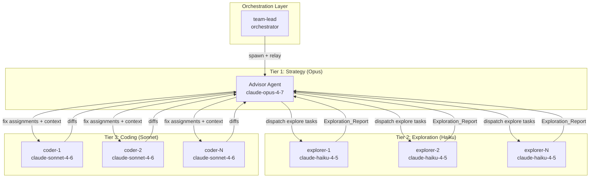
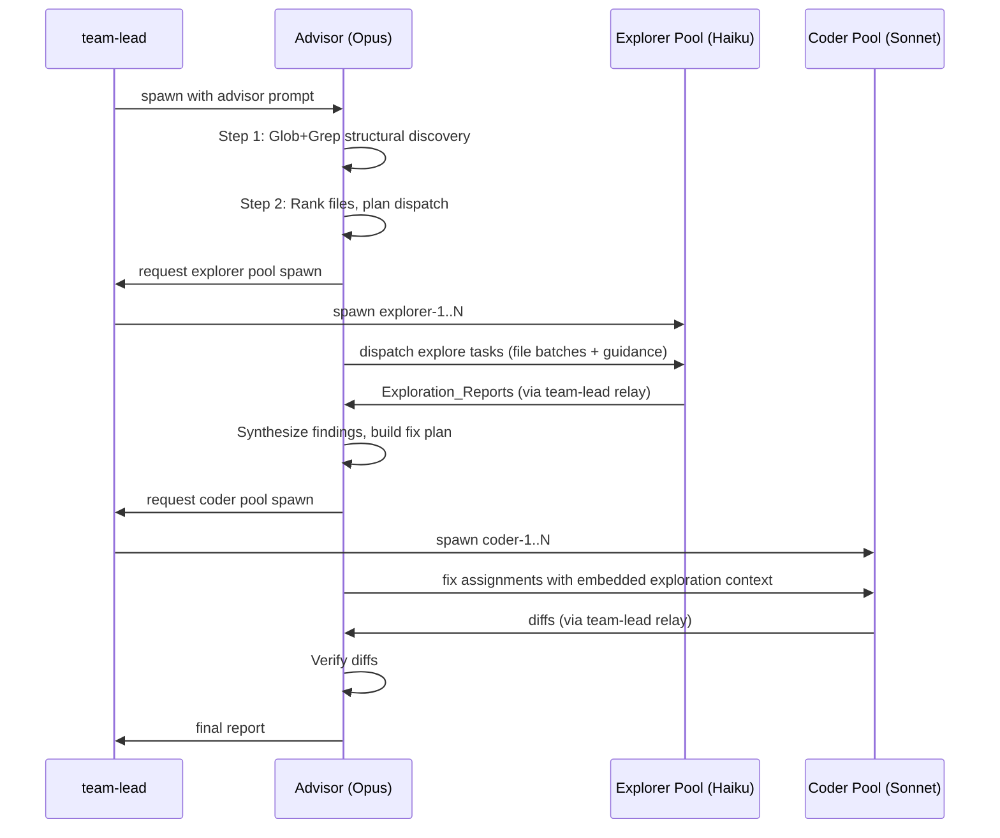

# Design Document: Tiered Agent Architecture

## Overview

This design introduces a three-tier agent architecture to the Advisor CLI's orchestration pipeline, splitting the current two-tier model (Opus advisor → Sonnet runners) into a cost-optimized topology: Opus advisor → Haiku explorers → Sonnet coders.

The key insight is economic: exploration (file reading, grep, glob, structural discovery) accounts for the bulk of runner token consumption but requires no write capability and minimal reasoning. Delegating this to Haiku (~12x cheaper per token than Sonnet) dramatically reduces cost without sacrificing code-modification quality.

**Current flow:**
```
Opus advisor → Sonnet runners (explore + fix)
```

**Target flow:**
```
Opus advisor → Haiku explorers (read-only) → Sonnet coders (write-only)
```

The advisor retains its strategist role — reasoning, planning, dispatch — but delegates file reading to Haiku explorers. Explorers feed structured context back to the advisor, who synthesizes findings and dispatches targeted fix assignments (with pre-gathered context) to Sonnet coders. Coders spend tokens writing, not reading.

### Design Decisions

1. **Additive extension, not rewrite**: New `explorer_model`, `max_explorers`, and explorer budget fields are added to the existing `TeamConfig` dataclass. The existing runner/coder path is preserved and activated when `max_explorers=0` (legacy two-tier mode).

2. **Explorer agents are ephemeral**: Unlike long-lived runners (now "coders"), explorers are rotated aggressively on budget limits because their value is in the *output* (Exploration_Report), not accumulated context.

3. **Advisor synthesizes, coders consume**: The advisor is the bridge between explore and fix waves. It receives Exploration_Reports, reasons over them, and embeds relevant context into fix assignments so coders never re-read files the explorer already gathered.

4. **Zero new runtime dependencies**: All changes are pure Python using existing stdlib patterns (dataclasses, string templates, os.environ).

## Architecture



### Pipeline Phases



### Legacy Mode (max_explorers=0)

When `max_explorers` is 0, the pipeline collapses to the existing two-tier behavior:
- No explorer agents are spawned
- Coder agents (formerly "runners") handle both exploration and fixing
- The advisor prompt omits all explorer-related instructions
- Cost estimation omits the explorer tier

## Components and Interfaces

### 1. TeamConfig Extension (`advisor/orchestrate/config.py`)

New fields added to the frozen `TeamConfig` dataclass:

```python
@dataclass(frozen=True, slots=True)
class TeamConfig:
    # ... existing fields ...
    
    # Explorer tier configuration
    explorer_model: str = "claude-haiku-4-5"
    max_explorers: int = ...  # defaults to max_runners (post-clamp)
    explorer_output_char_ceiling: int = 40_000
    explorer_file_read_ceiling: int = 40
```

The `default_team_config` function is extended with:
- `explorer_model` parameter (default: `"claude-haiku-4-5"`)
- `ADVISOR_EXPLORER_MODEL` env var fallback
- `max_explorers` parameter (default: mirrors `max_runners`)
- `ADVISOR_MAX_EXPLORERS` env var fallback with int validation
- `explorer_output_char_ceiling` parameter with `ADVISOR_EXPLORER_OUTPUT_CHAR_CEILING` env var
- `explorer_file_read_ceiling` parameter with `ADVISOR_EXPLORER_FILE_READ_CEILING` env var
- Clamping for `max_explorers` to `[0, POOL_SIZE_CEILING]` (note: 0 is valid — enables legacy mode)
- Clamping for budget fields to minimum of 1
- `warn_unknown_model` check extended to `explorer_model`

### 2. Explorer Prompt Builder (`advisor/orchestrate/explorer_prompts.py`)

New module containing:

```python
def build_explorer_prompt(
    config: TeamConfig,
    target_files: Sequence[str],
    guidance: Mapping[str, str],
) -> str:
    """Build the complete explorer agent prompt.
    
    Args:
        config: Team configuration.
        target_files: Sequence of file paths this explorer should read.
        guidance: Mapping of file path → advisor guidance string describing
            what to look for in each file.
    
    Returns:
        Complete prompt text restricting the agent to read-only operations.
    """
```

The prompt template (`_prompts/explorer.txt`) instructs the explorer to:
- Use ONLY Read, Glob, and Grep tools
- Explicitly prohibit file writing, editing, or deletion
- Open each message with `SCOPE: <file> · <stage>` anchor
- Return structured Exploration_Reports containing:
  - File paths read
  - Code snippets with file path and line-number ranges
  - Structural observations (function/class signatures, import relationships, call-site locations)
- Report to team-lead via `SendMessage(to='team-lead')`
- Handle unreadable files gracefully (record path + failure reason, continue)

```python
def build_explorer_pool_agents(
    config: TeamConfig,
    pool_size: int | None = None,
) -> list[dict[str, object]]:
    """Agent specs for the explorer pool (spawned before explore wave)."""
```

### 3. Coder Prompt Refactoring (`advisor/orchestrate/runner_prompts.py`)

The existing `build_runner_pool_prompt` function is refactored into `build_coder_prompt`:

```python
def build_coder_prompt(runner_id: int, config: TeamConfig) -> str:
    """Spawn prompt for a coder agent — write-focused, receives pre-gathered context.
    
    Removes exploration-related instructions (grep/glob discovery emphasis)
    and emphasizes code modification as the sole responsibility. Instructs
    the coder to use provided exploration context rather than re-reading files.
    """
```

Key changes from current `build_runner_pool_prompt`:
- Remove "explore assignment" section (coders don't explore)
- Add instruction to prefer embedded exploration context over re-reading
- Retain fix assignment handling, context pressure, SCOPE anchors
- Retain live-dialogue protocol with the advisor

`build_runner_pool_prompt` is preserved as a backward-compat alias that delegates to `build_coder_prompt`.

### 4. Fix Assignment Message Update (`advisor/orchestrate/runner_prompts.py`)

```python
def build_fix_assignment_message(
    *,
    file_path: str,
    problem: str,
    change: str,
    acceptance: str,
    fix_number: int,
    effective_cap: int,
    exploration_context: str | None = None,
) -> str:
    """Build a fix assignment message with optional exploration context.
    
    When exploration_context is provided, it is embedded before the fix
    instructions so the coder sees file contents without re-reading.
    When None or empty, produces the existing message format (legacy mode).
    """
```

### 5. Advisor Prompt Update (`advisor/orchestrate/_prompts/advisor.txt`)

The advisor prompt template is extended to describe the three-tier model:
- Step 2 (Rank and size pool) now includes sizing both explorer and coder pools
- Step 3 becomes "Dispatch explore wave to Haiku explorers" (instead of runners reading directly)
- New Step 3.5: "Synthesize Exploration_Reports" — advisor reasons over gathered context
- Step 4 (previously Step 5): "Dispatch fix wave to Sonnet coders with embedded context"
- Conditional block: when `max_explorers=0`, advisor operates in legacy two-tier mode

The advisor prompt uses a new placeholder `{explorer_model}` and conditional rendering based on `max_explorers`.

### 6. Advisor Prompt Builder Update (`advisor/orchestrate/advisor_prompt.py`)

```python
def build_advisor_prompt(config: TeamConfig, *, history_block: str = "") -> str:
    """Extended to pass explorer_model, max_explorers, and explorer budget
    fields into the template. Conditionally renders the three-tier or
    two-tier prompt sections based on max_explorers."""
```

New placeholders added:
- `{explorer_model}`
- `{max_explorers}`
- `{explorer_output_char_ceiling}`
- `{explorer_file_read_ceiling}`

### 7. Cost Estimation Update (`advisor/cost.py`)

```python
@dataclass(frozen=True, slots=True)
class CostEstimate:
    # ... existing fields ...
    
    # Explorer tier
    explorer_model: str = "claude-haiku-4-5"
    explorer_input_tokens_min: int = 0
    explorer_input_tokens_max: int = 0
    explorer_output_tokens_min: int = 0
    explorer_output_tokens_max: int = 0
    explorer_cost_usd_min: float = 0.0
    explorer_cost_usd_max: float = 0.0
```

`estimate_cost` signature extended:
```python
def estimate_cost(
    tasks: list[FocusTask],
    batches: list[FocusBatch] | None,
    *,
    advisor_model: str,
    runner_model: str,
    explorer_model: str = "claude-haiku-4-5",
    max_fixes_per_runner: int,
    max_runners: int | None = None,
    max_explorers: int | None = None,
    pricing: dict[str, tuple[int, int]] | None = None,
    target: Path | None = None,
) -> CostEstimate:
```

Explorer cost model:
- **Input tokens**: Sum of content tokens for all task files (explore wave read pass) + per-explorer system prompt overhead + message framing
- **Output tokens**: Per-explorer findings block (~1200 tokens per explorer for structured report)
- Uses `_family_of(explorer_model)` → haiku pricing

`format_estimate` displays per-tier breakdown:
```
- Advisor (Opus): $X.XX – $Y.YY
- Explorers (Haiku): $X.XX – $Y.YY  
- Coders (Sonnet): $X.XX – $Y.YY
- **Total: $X.XX – $Y.YY**
```

When `max_explorers=0`, explorer line is omitted and all explorer fields are 0.

### 8. Pipeline Rendering Update (`advisor/orchestrate/pipeline.py`)

`render_pipeline` extended to:
- Show `explorer_model` in the output header
- Include explorer spawn step between advisor and coder spawns
- Describe the loop as "Explorer discovers → Advisor reasons → Coder fixes"
- Display `max_explorers` in configuration summary
- Conditionally render legacy two-tier when `max_explorers=0`

### 9. Preset System Extension (`advisor/presets.py`)

```python
@dataclass(frozen=True, slots=True)
class RulePack:
    # ... existing fields ...
    explorer_model: str | None = None  # None → use TeamConfig default
```

When a preset specifies `explorer_model`, it overrides the default. When `None`, the TeamConfig default (`"claude-haiku-4-5"`) applies.

## Data Models

### TeamConfig (extended)

| Field | Type | Default | Env Var | Description |
|-------|------|---------|---------|-------------|
| `explorer_model` | `str` | `"claude-haiku-4-5"` | `ADVISOR_EXPLORER_MODEL` | Model for explorer agents |
| `max_explorers` | `int` | `= max_runners` | `ADVISOR_MAX_EXPLORERS` | Max concurrent explorers (0 = legacy mode) |
| `explorer_output_char_ceiling` | `int` | `40_000` | `ADVISOR_EXPLORER_OUTPUT_CHAR_CEILING` | Char ceiling before rotation |
| `explorer_file_read_ceiling` | `int` | `40` | `ADVISOR_EXPLORER_FILE_READ_CEILING` | File read ceiling before rotation |

### Exploration_Report (structured output from explorers)

The Exploration_Report is a text-based structured format (not a dataclass — it's produced by the explorer LLM and consumed by the advisor LLM). Format:

```
## Exploration Report — explorer-{i}

### Files Read
- `path/to/file.py` (lines 1-250)
- `path/to/other.py` (lines 1-80)

### Findings

#### `path/to/file.py`
**Guidance:** <what the advisor asked to look for>
**Snippets:**
```python
# lines 45-62
def authenticate(token: str) -> User:
    ...
```
**Structural observations:**
- Imports: os, sys, hashlib
- Classes: AuthHandler (methods: validate, refresh, revoke)
- Call sites: called from routes.py:23, middleware.py:67

#### `path/to/other.py`
...

### Failures
- `path/to/missing.py` — FileNotFoundError: No such file or directory
```

### Dispatch_Plan (advisor output)

The Dispatch_Plan is the structured output from the advisor that classifies tasks:

```
## Dispatch Plan

### Explore Wave
explorer-1:
- `src/auth.py` — look for token validation flow and session handling
- `src/session.py` — find session creation and expiry logic

explorer-2:
- `src/routes.py` — identify all request handlers and input parsing
- `src/middleware.py` — check auth middleware chain

### Fix Wave (after exploration)
coder-1:
- Fix auth token validation bypass (context from explorer-1)
- Fix session expiry race condition (context from explorer-1)

coder-2:
- Fix input sanitization in routes (context from explorer-2)
```

### CostEstimate (extended)

New fields added to `to_dict()` output:

| Field | Type | Description |
|-------|------|-------------|
| `explorer_model` | `str` | Model name for explorer tier |
| `explorer_input_tokens_min` | `int` | Min input tokens for explorer tier |
| `explorer_input_tokens_max` | `int` | Max input tokens for explorer tier |
| `explorer_output_tokens_min` | `int` | Min output tokens for explorer tier |
| `explorer_output_tokens_max` | `int` | Max output tokens for explorer tier |
| `explorer_cost_usd_min` | `float` | Min USD cost for explorer tier |
| `explorer_cost_usd_max` | `float` | Max USD cost for explorer tier |


## Correctness Properties

*A property is a characteristic or behavior that should hold true across all valid executions of a system — essentially, a formal statement about what the system should do. Properties serve as the bridge between human-readable specifications and machine-verifiable correctness guarantees.*

### Property 1: Explorer environment variable propagation

*For any* non-empty string set as `ADVISOR_EXPLORER_MODEL`, and *for any* valid integer string set as `ADVISOR_MAX_EXPLORERS`, `ADVISOR_EXPLORER_OUTPUT_CHAR_CEILING`, or `ADVISOR_EXPLORER_FILE_READ_CEILING`, calling `default_team_config` with default sentinel values SHALL produce a TeamConfig whose corresponding fields equal the parsed env var values.

**Validates: Requirements 1.2, 1.5, 7.6, 7.7**

### Property 2: Explorer environment variable fallback on invalid input

*For any* non-integer string set as `ADVISOR_MAX_EXPLORERS`, `ADVISOR_EXPLORER_OUTPUT_CHAR_CEILING`, or `ADVISOR_EXPLORER_FILE_READ_CEILING`, calling `default_team_config` SHALL emit a warning to stderr and produce a TeamConfig whose field equals the documented default (max_runners-derived for max_explorers, 40000 for char ceiling, 40 for file ceiling).

**Validates: Requirements 1.6, 7.6, 7.7**

### Property 3: Explorer config field clamping invariant

*For any* integer value passed as `max_explorers`, the resulting TeamConfig field SHALL be in the range `[0, POOL_SIZE_CEILING]`. *For any* integer value passed as `explorer_output_char_ceiling` or `explorer_file_read_ceiling`, the resulting TeamConfig field SHALL be >= 1. When the input falls outside the valid range, a warning SHALL be emitted to stderr.

**Validates: Requirements 1.7, 7.8**

### Property 4: Default max_explorers mirrors max_runners

*For any* valid `max_runners` value (after clamping to [1, POOL_SIZE_CEILING]), when `max_explorers` is not explicitly provided, the resulting TeamConfig SHALL have `max_explorers` equal to the post-clamp `max_runners` value.

**Validates: Requirements 1.4, 10.1**

### Property 5: Unknown explorer model warning

*For any* string that fails `is_known_model` validation, calling `default_team_config` with `warn_unknown_model=True` and that string as `explorer_model` SHALL emit a warning to stderr containing the model name.

**Validates: Requirements 1.3**

### Property 6: Explorer agent spec structure

*For any* TeamConfig with `max_explorers > 0` and *for any* pool size in `[1, max_explorers]`, `build_explorer_pool_agents` SHALL produce exactly `pool_size` agent specs where each spec has: the configured `explorer_model`, `run_in_background=True`, the configured `team_name`, `subagent_type="explorer"`, and names matching `explorer-{i}` with `i` sequential from 1.

**Validates: Requirements 2.1, 2.2, 2.4**

### Property 7: Explorer prompt read-only invariants

*For any* valid TeamConfig, *any* non-empty sequence of file paths, and *any* mapping of paths to guidance strings, `build_explorer_prompt` SHALL return a non-empty string that contains: instructions to use Read/Glob/Grep tools, explicit prohibition of file writing/editing/deletion, the SCOPE anchor protocol, and SendMessage-to-team-lead instructions.

**Validates: Requirements 4.1, 4.2, 4.4, 4.5, 4.6**

### Property 8: Explorer prompt guidance embedding

*For any* file path and *any* non-empty guidance string in the guidance mapping, `build_explorer_prompt` SHALL embed that guidance string in the returned prompt text (the guidance round-trips from input to output).

**Validates: Requirements 4.7**

### Property 9: Coder prompt focuses on code modification

*For any* valid TeamConfig, `build_coder_prompt` SHALL return a prompt that contains instructions to prefer embedded exploration context over re-reading files and emphasizes code modification as the primary responsibility.

**Validates: Requirements 5.2, 5.4**

### Property 10: Fix assignment exploration context embedding

*For any* valid fix assignment parameters: when `exploration_context` is None or empty, the output SHALL NOT contain an exploration context section marker; when `exploration_context` is a non-empty string, the output SHALL contain that string positioned before the fix instruction content.

**Validates: Requirements 5.6, 5.7**

### Property 11: Legacy mode prompt and rendering (max_explorers=0)

*For any* TeamConfig with `max_explorers=0`, `build_advisor_prompt` SHALL produce a prompt describing legacy two-tier mode without explorer dispatch instructions, and `render_pipeline` SHALL produce output without Explorer_Agent references.

**Validates: Requirements 6.6, 9.5**

### Property 12: Three-tier cost estimation

*For any* non-empty task list and *any* TeamConfig with `max_explorers > 0`, `estimate_cost` SHALL produce a CostEstimate where explorer token and cost fields are positive, computed using the `explorer_model` pricing family (haiku). When `max_explorers=0`, all explorer fields SHALL be 0.

**Validates: Requirements 8.2, 8.4**

### Property 13: Cost estimate format per-tier breakdown

*For any* CostEstimate with positive explorer cost fields, `format_estimate` SHALL produce output containing separate cost lines for advisor, explorer, and coder tiers. When explorer fields are 0, the explorer line SHALL be absent.

**Validates: Requirements 8.3, 8.4**

### Property 14: CostEstimate serialization includes explorer fields

*For any* CostEstimate, `to_dict()` SHALL return a dict containing keys: `explorer_model`, `explorer_input_tokens_min`, `explorer_input_tokens_max`, `explorer_output_tokens_min`, `explorer_output_tokens_max`, `explorer_cost_usd_min`, `explorer_cost_usd_max`.

**Validates: Requirements 8.5**

### Property 15: Pipeline rendering includes explorer tier

*For any* TeamConfig with `max_explorers > 0`, `render_pipeline` SHALL produce output containing the `explorer_model` string, an explorer spawn step, and the `max_explorers` value.

**Validates: Requirements 9.1, 9.2, 9.4**

### Property 16: Model flag isolation

*For any* advisor_model and runner_model strings passed to `default_team_config`, the resulting `explorer_model` SHALL remain at the default `"claude-haiku-4-5"` (assuming no ADVISOR_EXPLORER_MODEL env var is set).

**Validates: Requirements 10.4**

### Property 17: Preset explorer_model override

*For any* RulePack with a non-None `explorer_model` field, applying the preset SHALL set the TeamConfig's `explorer_model` to the preset's value. *For any* RulePack with `explorer_model=None`, the TeamConfig SHALL retain the default `"claude-haiku-4-5"`.

**Validates: Requirements 10.6**

## Error Handling

### Configuration Errors

| Error Condition | Handling | User Feedback |
|----------------|----------|---------------|
| `ADVISOR_EXPLORER_MODEL` env var empty | Fall through to default `"claude-haiku-4-5"` | None (silent default) |
| `ADVISOR_MAX_EXPLORERS` non-integer | Fall back to max_runners-derived default | Warning to stderr |
| `max_explorers` < 0 | Clamp to 0 (legacy mode) | Warning to stderr |
| `max_explorers` > POOL_SIZE_CEILING | Clamp to POOL_SIZE_CEILING | Warning to stderr |
| `explorer_output_char_ceiling` < 1 | Clamp to 1 | Silent (matches existing pattern) |
| `explorer_file_read_ceiling` < 1 | Clamp to 1 | Silent (matches existing pattern) |
| Unknown `explorer_model` string | Config still constructed | Warning to stderr (advisory) |

### Runtime Errors

| Error Condition | Handling |
|----------------|----------|
| Explorer fails to respond within 120s | Advisor logs failure, re-dispatches to fresh explorer or falls back to coder |
| Explorer returns malformed report | Advisor treats as incomplete, re-dispatches affected files |
| File unreadable by explorer | Explorer records path + reason in report, continues with remaining files |
| Explorer hits budget ceiling mid-batch | Explorer sends partial report, advisor rotates to fresh explorer |

### Backward Compatibility Errors

| Scenario | Handling |
|----------|----------|
| Old config without explorer fields | Dataclass defaults apply — three-tier mode enabled automatically |
| `max_explorers=0` explicitly set | Legacy two-tier mode — no explorers spawned, coders do both |
| Preset without `explorer_model` | Falls back to TeamConfig default `"claude-haiku-4-5"` |

## Testing Strategy

### Property-Based Tests (Hypothesis)

Property-based testing is well-suited for this feature because the core modules (`config.py`, `explorer_prompts.py`, `runner_prompts.py`, `cost.py`, `pipeline.py`) are pure functions with clear input/output contracts and large input spaces (arbitrary strings for model names, arbitrary integers for pool sizes and ceilings, arbitrary file paths and guidance mappings).

**Library**: [Hypothesis](https://hypothesis.readthedocs.io/) (already in dev dependencies)

**Configuration**: Minimum 100 examples per property test (`@settings(max_examples=100)`)

**Tag format**: Each test is annotated with a comment:
```python
# Feature: tiered-agent-architecture, Property {N}: {property_text}
```

Each correctness property (1–17) maps to a single Hypothesis property test. Generators include:
- `st.text(min_size=1)` for model names and env var values
- `st.integers()` for pool sizes, ceilings
- `st.lists(st.text(min_size=1))` for file path sequences
- `st.dictionaries(st.text(min_size=1), st.text())` for guidance mappings
- Composite strategies for TeamConfig construction

### Unit Tests (pytest)

Example-based tests cover:
- Structural defaults (1.1, 7.1, 7.2, 8.1)
- Specific integration scenarios (2.2, 2.5, 2.6, 4.3, 4.8, 5.3, 5.5)
- Prompt content checks for LLM behavioral requirements (6.1–6.5, 9.3)
- Backward compatibility smoke tests (10.2, 10.3, 10.5)

### Integration Tests

- End-to-end `default_team_config` with realistic env vars
- `estimate_cost` with real file system stats
- `render_pipeline` visual regression (snapshot tests against golden output)
- `build_advisor_prompt` rendering with all combinations of max_explorers (0 vs >0)

### Test Organization

```
tests/
├── test_config_explorer.py          # Properties 1-5, 16-17 + unit tests for Req 1, 7, 10
├── test_explorer_prompts.py         # Properties 6-8 + unit tests for Req 2, 4
├── test_coder_prompts.py            # Properties 9-10 + unit tests for Req 5
├── test_advisor_prompt_tiered.py    # Property 11 + unit tests for Req 6
├── test_cost_tiered.py              # Properties 12-14 + unit tests for Req 8
└── test_pipeline_tiered.py          # Property 15 + unit tests for Req 9
```
