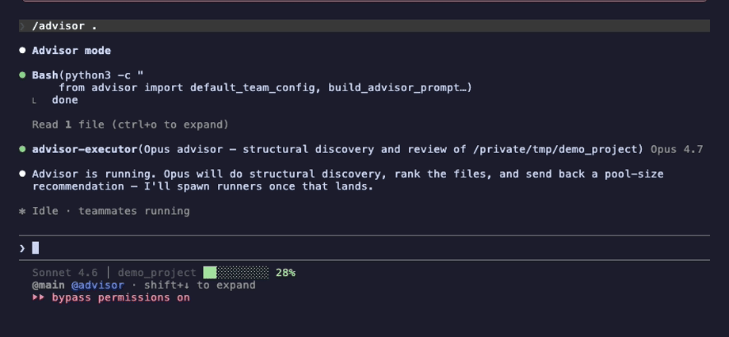

# advisor



A one-command, Opus-led code review-and-fix pipeline for Claude Code. Opus
goes first — does its own Glob+Grep discovery, ranks files P1–P5, and
**writes a unique, file-aware prompt for every agent** based on what it
just learned. Then it stays online and **actively steers the team
throughout**: redirecting drift, answering questions in real time, verifying
each output the moment it lands, and adjusting the plan when a finding
changes the picture. Opus is the strategist that never goes idle until the
final report ships. Optional fix wave applies edits the same way.

No external API calls. Runs entirely through Claude Code's native
`TeamCreate` / `Agent` / `SendMessage` tools.

**Implementation:** Rust (`advisor-rs` crate, `advisor` CLI). The Python
package has been superseded on `main`; see [`RUST_PORT_PLAN.md`](RUST_PORT_PLAN.md)
and [`PORT_NOTES.md`](PORT_NOTES.md) for migration status.

## Team (three-tier, default)

| Role | Model | Agent type | Job |
|------|-------|------------|-----|
| **Advisor** | Opus 4.7 (`claude-opus-4-7`) | `generalPurpose` | Glob+Grep discovery, P1–P5 ranking, sizes explorer + coder pools, writes per-agent prompts, dispatches explore + fix waves — stays live: redirects drift, answers questions, verifies each output, adjusts plan mid-wave |
| **Explorer pool** | Haiku 4.5 (`claude-haiku-4-5`) × N | `explore` | Read-only structural discovery on advisor-assigned file batches; reports findings to team-lead → advisor |
| **Coder pool** | Sonnet 4.6 (`claude-sonnet-4-6`) × N | `generalPurpose` | Long-lived fix workers; each gets a domain-specific prompt (with exploration context on fix assignments); reports findings + diffs to team-lead → advisor |

Priority scale: **P5** auth/secrets · **P4** user input/parsing · **P3** handlers/DB/exec · **P2** config/crypto/logging · **P1** utils/tests.

Loop: **Explorer discovers → Advisor reasons → Coder fixes.**

<details>
<summary>Legacy two-tier mode</summary>

Set `max_explorers=0` or `ADVISOR_MAX_EXPLORERS=0` to skip the explorer
wave and run the original advisor + Sonnet-runner pipeline.

</details>

## Install

### From source (recommended)

Requires [Rust](https://rustup.rs/) **1.74+**. The binary has **zero runtime
dependencies** — only the Rust toolchain is needed to build.

```bash
git clone https://github.com/vzwjustin/advisor && cd advisor
cargo install --path .
advisor install          # wire SKILL.md + CLAUDE.md nudge (idempotent)
advisor status           # confirm what landed where
```

After edits, reinstall with `cargo install --path . --force`.

<details>
<summary>Other install methods</summary>

```bash
# Install a tagged release without cloning (needs Rust + git)
cargo install --git https://github.com/vzwjustin/advisor --tag v0.8.6

# Run without installing
cargo run -- version
cargo run -- pipeline src/

# PyPI (published releases — package name advisor-agent)
pipx install advisor-agent
pipx upgrade advisor-agent

# Plain pip / uv
pip install advisor-agent
uv tool install advisor-agent
```

PyPI releases may trail `main` during the Rust migration. For the latest
features (three-tier architecture, Rust port), build from source.

</details>

The first `advisor install` wires `~/.claude/CLAUDE.md` and the `/advisor`
slash command automatically. The CLAUDE.md block also embeds a 4-rule
**Behavioral Guidelines** section (Think Before · Simplicity First ·
Surgical Changes · Goal-Driven Execution). Every upgrade prints a "What's
new" digest from `CHANGELOG.md`.

<details>
<summary>Manage the nudge / skill manually</summary>

```bash
advisor status               # install health check
advisor install              # append / update the nudge + skill (idempotent)
advisor install --check      # dry-run: print status, exit 3 if anything missing
advisor uninstall            # cleanly remove the nudge + skill
advisor install --path /x    # target a different CLAUDE.md
```

Opt out of auto-install with `ADVISOR_NO_NUDGE=1`. Suppress the diagnostic TTY spinner with `ADVISOR_QUIET=1`. The CLAUDE.md block is
wrapped in `<!-- advisor:nudge:start -->` / `<!-- advisor:nudge:end -->`
markers so reinstalls update in place.

</details>

## Usage

Invoke from inside Claude Code:

```
/advisor                    # review the cwd
/advisor src/               # review a specific dir
/advisor review the auth flow      # add scope context
```

Or use the standalone CLI to inspect the prompts and plans:

```bash
advisor pipeline src/                  # full pipeline reference (three-tier by default)
advisor protocol                       # print the strict team-lifecycle protocol
advisor plan src/                      # rank local files, print dispatch plan
advisor plan src/ --json               # same, machine-readable for `jq` etc.
advisor plan src/ --format json        # explicit selector (alias of --json; pretty overrides)
advisor plan src/ --sarif out.sarif    # SARIF 2.1.0 output for Code Scanning
advisor audit RUN_ID [TARGET]          # post-hoc diagnostic for a completed run
advisor prompt advisor src/            # the advisor's prompt body
advisor prompt runner src/ --runner-id 1   # a coder's bootstrap prompt
advisor prompt verify src/ < findings  # verify-pass prompt
advisor status                         # install health check
advisor status --json                  # JSON-formatted health for scripting
advisor doctor                         # extended diagnostic: git/claude/codex/env checks
advisor install                        # install nudge + /advisor skill (prints What's new on upgrade)
advisor update                         # self-upgrade via PyPI, then re-runs install
advisor changelog [VERSION]            # print bundled CHANGELOG section(s); --since X.Y.Z for a digest
advisor uninstall                      # remove nudge + /advisor skill
advisor ui                             # launch local web dashboard on 127.0.0.1:8765 (Findings · Live · Plan · Run config · Cost)
advisor live tail                      # tail the live event stream (the Live tab subscribes to this)
advisor history                        # recent findings from .advisor/history.jsonl
advisor history --stats                # aggregate: confirm rate, breakdowns, top files
advisor baseline create                # snapshot current findings as baseline
advisor baseline diff                  # compare current run vs. baseline
advisor checkpoints                    # list saved plan checkpoints
advisor checkpoints --rm RUN_ID        # delete a single checkpoint
advisor checkpoints --clear            # delete all checkpoints
advisor presets                        # list available rule-pack presets
advisor suppressions --list            # list active false-positive suppressions
advisor version                        # print version + environment info
```

Every subcommand's `target` defaults to `.` (current directory). Piping a
long scope description is supported via `--context -` (reads stdin).

Flags: `--team`, `--file-types`, `--max-runners` (advisory — Opus may
exceed for large repos), `--min-priority`, `--context`, `--advisor-model`,
`--runner-model`. Default models: `claude-opus-4-7` / `claude-sonnet-4-6` / `claude-haiku-4-5` (full IDs pin the version; bare aliases `opus`/`sonnet`/`haiku` resolve to the latest at spawn time).

Environment overrides (also read by `default_team_config`):

| Variable | Default | Effect |
|----------|---------|--------|
| `ADVISOR_MODEL` | `claude-opus-4-7` | Advisor model |
| `ADVISOR_RUNNER_MODEL` | `claude-sonnet-4-6` | Coder model |
| `ADVISOR_EXPLORER_MODEL` | `claude-haiku-4-5` | Explorer model |
| `ADVISOR_MAX_RUNNERS` | `5` | Suggested coder pool size |
| `ADVISOR_MAX_EXPLORERS` | same as max runners | Explorer pool size (`0` = legacy two-tier) |
| `ADVISOR_MIN_PRIORITY` | `3` | Minimum P-rank to include |
| `ADVISOR_FILE_TYPES` | `*.*` | Glob filter for `advisor plan` |
| `ADVISOR_EXPLORER_OUTPUT_CHAR_CEILING` | `40000` | Explorer output budget |
| `ADVISOR_EXPLORER_FILE_READ_CEILING` | `40` | Explorer distinct-file-read cap |

Context-pressure knobs (reduce coder context exhaustion):
`--max-fixes-per-runner N` · `--large-file-line-threshold N` · `--large-file-max-fixes M` · `--runner-output-char-ceiling K` · `--runner-file-read-ceiling L`.

Automation flags: `--json` on `status`/`plan`/`install --check`,
`--quiet` on `install`/`uninstall`, `--strict` on `status`/`install`/`uninstall`
(exit `3` when nothing changed or the install is unhealthy).

Colors are on by default. Opt out with `NO_COLOR=1` or `TERM=dumb`.

## Excluding files (`.advisorignore`)

Drop an `.advisorignore` file into your project root to skip paths during
`advisor plan` and the live pipeline:

```gitignore
# comments begin with #
tests/            # skip directories (trailing slash)
*.md              # skip by filename glob
vendor/
generated/**/*.py # ** recursive globs are supported
```

Patterns follow `fnmatch` semantics for filename matches, and use
`PurePath.match` when `**` is present. Bare words match any path
component (`docs` matches both `docs/` and `foo/docs/bar.py`).

## Rust library

The crate root re-exports the same surface the Python package exposed:

```rust
use advisor::{
    default_team_config, TeamConfig, TeamConfigInput,
    build_advisor_prompt, build_explorer_prompt, build_explorer_pool_agents,
    build_coder_prompt, build_runner_pool_prompt, build_runner_dispatch_messages,
    build_fix_assignment_message, build_verify_dispatch_prompt, build_verify_message,
    render_pipeline, rank_files, create_focus_tasks, parse_findings_from_text,
    estimate_cost, findings_to_sarif, resolve_version,
};

let config = default_team_config(TeamConfigInput::new("src/"));
println!("{}", render_pipeline(&config));
```

Builder functions return plain strings or JSON-friendly structs — drop them
into Claude Code `Agent(...)` or `SendMessage(...)` calls. See `src/lib.rs`
for the full export list.

## Modules (`src/`)

| Module | Role |
|--------|------|
| `config.rs` | `TeamConfig`, env-var assembly, model validation |
| `orchestrate/` | Advisor, explorer, and coder prompt builders; `render_pipeline` |
| `rank.rs` | `rank_files`, keyword-signal P1–P5 ranking |
| `focus.rs` | `create_focus_tasks` / `create_focus_batches`, plan formatters |
| `verify.rs` | `Finding`, `parse_findings_from_text`, verify-pass builders |
| `runner_budget.rs` | Per-coder output-char budget and rotation |
| `install.rs` | Idempotent CLAUDE.md nudge + `/advisor` skill install |
| `doctor.rs` | Git / Claude / Codex / install health checks |
| `audit.rs` | Post-hoc run transcript diagnostics |
| `baseline.rs` | Finding baselines for drift detection |
| `checkpoint.rs` | Plan checkpoints for `--resume` |
| `cost.rs` | Per-tier token and cost range estimates |
| `git_scope.rs` | `--since` / `--staged` / `--branch` scoping |
| `history.rs` | Confirmed findings log (`.advisor/history.jsonl`) |
| `sarif.rs` | SARIF 2.1.0 serializer |
| `suppressions.rs` | Per-rule false-positive suppressions |
| `skill_asset.rs` | Bundled `/advisor` skill content |
| `web.rs` | Local dashboard (`advisor ui`) |
| `live.rs` | Ephemeral event stream for the Live tab |

Prompt templates live under `src/assets/` (`advisor.txt`, `explorer.txt`, …).

## Live dashboard (new in 0.8.0)

Run `advisor ui` and open http://127.0.0.1:8765 to watch a `/advisor`
run in real time without keeping Claude Code in the foreground. The
**Live** tab polls `/api/events` every 2s and renders the team-lead's
event stream as a feed: each runner spawn, every report relay, every
fix dispatch, and the final run summary. Newly-arrived rows briefly
flash; FIFO-trimmed at 500 rows; respects `prefers-reduced-motion`.

The team-lead emits events via `advisor live record` at three
checkpoints (`run_start`, every `report_relay`, `run_end`), instructed
by the bundled `/advisor` skill body. Events are best-effort: a failed
write never halts the pipeline. Users who never start `advisor ui` see
no behavior change — the events file just accumulates harmlessly in
`<target>/.advisor/live/events.jsonl`.

The event store is deliberately separate from `history.jsonl`:
- `history.jsonl` — authoritative CONFIRMED findings; drives ranker
  boost, SARIF emission, repeat-offender analytics.
- `live/events.jsonl` — ephemeral event feed; opaque to the
  orchestrator, advisory to the dashboard, free-form payload.

For ad-hoc inspection from the terminal: `advisor live tail --limit 50`
(`--json` for scripting). `advisor live clear` removes the file; the
cursor preserves cleanly so the next run resumes the stream.

## Orchestration rules

- `TeamCreate` before any agent spawn; `TeamDelete` before creating a new team.
- Opus goes first — no explorers or coders until Opus's first pass produces pool sizes.
- Each agent is spawned with the **verbatim per-agent prompt** from
  Opus's dispatch plan. Don't substitute a generic template.
- Dispatch agents in a **single message** with `run_in_background=true`
  so they come up in parallel.
- Every agent prompt must end with a `SendMessage(...)` — agents go idle
  silently otherwise.
- Shut down teammates individually by name; broadcast shutdown does not work.

See `CLAUDE.md` for the full protocol.

## Development

```bash
git clone https://github.com/vzwjustin/advisor && cd advisor
cargo build
make check        # clippy + fmt --check + test
cargo test        # 125+ parity tests (Linux, macOS, Windows in CI)
cargo fmt         # format
cargo clippy --all-targets
```

Release checklist: `make release-check` (prints version + tag commands).

Version lives in `Cargo.toml`; tag with `git tag vX.Y.Z && git push origin vX.Y.Z`.

## GitHub Action

Reusable workflow that runs `advisor plan`, uploads SARIF 2.1.0 output to
GitHub Code Scanning, and (optionally) posts a PR comment. Paste this into
`.github/workflows/advisor.yml` in your repo:

```yaml
name: Advisor

on:
  pull_request:
  push:
    branches: [main]

jobs:
  advisor:
    uses: vzwjustin/advisor/.github/workflows/advisor.yml@v0.8.6
    with:
      target: "."
      min-priority: 3
      preset: "python-web"   # optional rule-pack tuning
      post-pr-comment: false
```

> [!NOTE]
> The `fail-on` parameter is enforced by a SARIF-parsing step that runs after `actions/upload-sarif`. Because `advisor plan --sarif` emits an empty-results document by design, the gate is a no-op unless a downstream step replaces `advisor.sarif` with real findings (e.g. SARIF captured from a live `/advisor` run). Threshold semantics match `advisor audit --fail-on`: the gate reads each result's `properties.severity` (which advisor's SARIF writer emits) so `critical` and `high` are correctly distinguished. For third-party SARIF that lacks `properties.severity`, the gate falls back to the SARIF level field (CRITICAL/HIGH → `error`, MEDIUM → `warning`, LOW → `note`) which cannot distinguish CRITICAL from HIGH.

Or roll your own: any CI system can run `advisor plan --sarif advisor.sarif`
and upload the file to whatever scanner you use.

## Presets

Curated rule-pack bundles tune file-type defaults and priority keywords for
common stacks:

| Preset             | Stack                        | Defaults                           |
|--------------------|------------------------------|------------------------------------|
| `general-python`   | Generic Python codebase      | `*.py`, no stack-specific boosting |
| `python-web`       | Flask / Django / FastAPI     | `*.py`, P5 auth keywords           |
| `python-cli`       | argparse / click CLIs        | `*.py`, P3 subprocess keywords     |
| `node-api`         | Express / Fastify / Koa      | `*.js,*.ts`, P5 JWT/session        |
| `typescript-react` | React + TS                   | `*.ts,*.tsx`, P4 DOM sinks         |
| `go-service`       | net/http services            | `*.go`, P3 net/http/sql            |
| `rust-crate`       | library / crate              | `*.rs`, P3 unsafe/transmute        |

```bash
advisor plan src/ --preset python-web
advisor presets            # list presets
advisor presets --json     # machine-readable
```

## Automation flags

Findings come from `advisor audit` (the verify pass) — `advisor plan`
prints the dispatch ranking. The gating + emit flags that depend on
findings (`--fail-on`, `--format pr-comment`, `--baseline`) only exist
on `audit`. `--sarif` exists on both — `plan` writes an empty-results
document (no findings yet), `audit` writes the real one.

| Flag                       | Applies to      | Effect                                    |
|----------------------------|-----------------|-------------------------------------------|
| `--sarif PATH`             | `plan`, `audit` | Write SARIF 2.1.0 for Code Scanning       |
| `--fail-on LEVEL`          | `audit`         | Exit 4 if any finding ≥ LEVEL             |
| `--format pr-comment`      | `audit`         | Emit a PR-body-ready markdown summary     |
| `--baseline PATH`          | `audit`         | Suppress findings matching a baseline     |
| `--no-history`             | `plan`          | Ignore history for deterministic CI plans |
| `--json` / `--output FILE` | `plan`, `audit` | Machine-readable output                   |

Exit codes: `0` clean · `4` `--fail-on` threshold tripped · `3` `--strict`
no-op or unhealthy install · `2` argparse / user error · `1` unexpected.

## Findings lifecycle

- **`advisor history`** — recent confirmed findings from `.advisor/history.jsonl` (`--stats` for an aggregate view)
- **`advisor baseline create`** — snapshot current findings as an accepted baseline
- **`advisor baseline diff`** — compare current run vs. baseline
- **`.advisor/suppressions.jsonl`** — per-rule, per-file suppressions with
  expiry dates (run `advisor suppressions` to list, add `--expired` to filter)

## Further reading

- [`docs/architecture.md`](docs/architecture.md) — module dependency graph,
  runtime flow, data contract, design invariants
- [`docs/prompts.md`](docs/prompts.md) — prompt engineering notes for
  contributors modifying prompt templates
- [`RUST_PORT_PLAN.md`](RUST_PORT_PLAN.md) — Rust migration plan
- [`PORT_NOTES.md`](PORT_NOTES.md) — Python parity status

## License

[MIT](LICENSE) — Copyright (c) 2025–2026 Justin Adams ([@vzwjustin](https://github.com/vzwjustin)).
